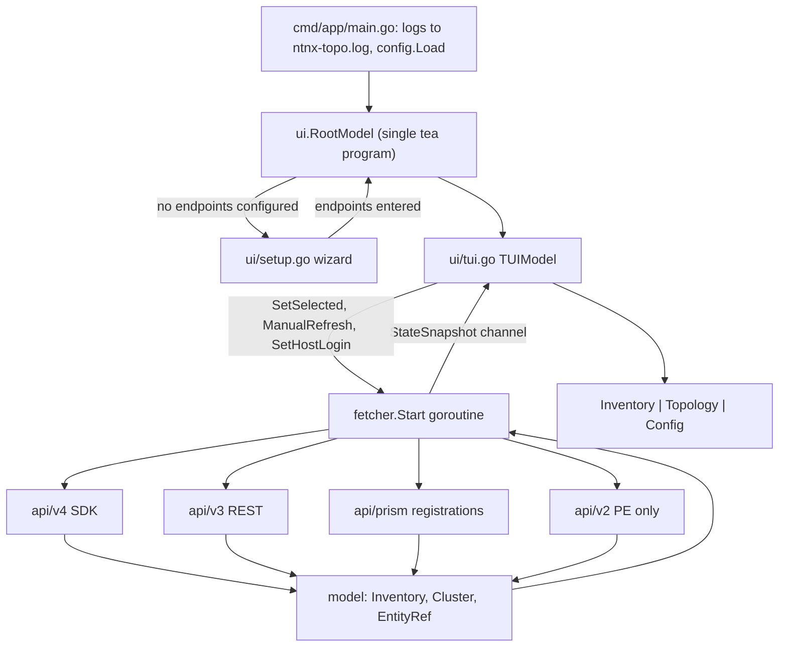

# ntnx-topo Architecture Document — v2 (current)

**Version:** v2, covering the three-pane dashboard (Inventory | Topology | Config), multi-PC
inventory and the in-TUI login overlay.
**Previous version:** [docs/ARCHITECTURE_v1.md](docs/ARCHITECTURE_v1.md) describes the old
single-pane app and is kept only for history.
**Companion docs:** [docs/DECISIONS.md](docs/DECISIONS.md) (why), [docs/CODEMAP.md](docs/CODEMAP.md)
(one-line file index), [docs/TODO.md](docs/TODO.md) (confirmed bugs), [docs/SECURITY_REVIEW.md](docs/SECURITY_REVIEW.md).

## 1. Directory Structure

```
~/Documents/ntnx-topo/
├── cmd/
│   └── app/
│       └── main.go                 # Entrypoint — logging to file, config, ui.NewRoot
├── internal/
│   ├── config/
│   │   └── config.go               # YAML + env + CLI flags; prism_centrals[]; NeedsWizard()
│   ├── model/
│   │   ├── topology.go             # Node, Edge, Cluster, Inventory forest, Racks(), EntityRef, ConfigField
│   │   └── state.go                # Thread-safe AppState + copy-safe StateSnapshot
│   ├── api/
│   │   ├── client.go               # Shared BaseClient: HTTPS :9440, basic auth, JSON, APIError
│   │   ├── probe.go                # HostFromURL, LooksLikeUUID, NormalizeHost, ProbeReachable
│   │   ├── v2/
│   │   │   ├── endpoints.go        # Prism Element v2 endpoint paths + response structs
│   │   │   └── client.go           # v2 REST client: PE-only topology, optional host_nics
│   │   ├── v3/
│   │   │   ├── endpoints.go        # Prism Central v3 endpoint paths + response structs
│   │   │   └── client.go           # v3 fallback: inventory, availability zones, cluster/host GET
│   │   ├── v4/
│   │   │   ├── endpoints.go        # v4 API version constant
│   │   │   └── client.go           # v4 SDK: ListInventory, FetchPETopology, GetClusterById, NICs
│   │   └── prism/
│   │       ├── client.go           # Domain-manager registrations + ENABLED products (v4.2→4.1→4.0→4.3)
│   │       └── parse_test.go       # Flexible registration JSON (string-or-object status/type)
│   ├── fetcher/
│   │   ├── fetcher.go              # Polling, per-PC fallback, AZ join, FetchEntityConfig, SetHostLogin
│   │   ├── audit_test.go           # Offline checks pinning confirmed bugs (KNOWN BUG ids)
│   │   └── live_test.go            # Live cluster suite, gated on NTNX_TEST_PCS
│   └── ui/
│       ├── styles.go               # Lipgloss v2 colors, italic pane titles, tabs, hover box
│       ├── root.go                 # RootModel: setup wizard → dashboard, one tea.Program
│       ├── setup.go                # Wizard: PC count, IP, username, password
│       ├── tui.go                  # TUIModel: keys, mouse, panes, Config, login overlay
│       ├── inventory.go            # Flatten the forest into rows; health suffixes
│       ├── split.go                # layoutPanes, two drag targets, dividers, clipFrame, overlayAt
│       ├── view.go                 # PE topology drawing, Topology header, footer
│       ├── pcgraph.go              # PC/AZ pairing graph: paired bands + not-paired row
│       ├── datacenter.go           # Rack-per-switch drawing
│       ├── hits.go                 # Hit rects, artPiece composition, hover boxes
│       ├── viewport.go             # Zoom steps, applyViewport, viewportTransform
│       ├── config.go               # Config pane key/value renderer
│       ├── reconnect.go            # Session-only IP/user/password overlay
│       ├── legend.go               # L-key command legend
│       └── *_test.go               # pane, pcgraph, reconnect and headless driver tests
├── docs/                           # AI_HANDOFF, DECISIONS, CODEMAP, TODO, SECURITY_REVIEW, ARCHITECTURE_v1
├── config.yaml                     # Optional configuration file (not required; wizard covers it)
├── go.mod / go.sum                 # Go module definition
├── .gitignore
└── README.md
```

### Why This Layout

The project follows the standard Go project layout convention:

- `cmd/` holds the executable entrypoint only -- no business logic.
- `internal/` prevents external packages from importing internals.
- Each sub-package has a single responsibility (config, model, api, fetcher, ui).
- The API clients are versioned into `v2/`, `v3/`, `v4/` sub-packages because they
  have completely different wire protocols and response shapes. `prism/` sits alongside
  them because the domain-manager endpoints are versioned separately from clustermgmt
  and are called over raw HTTP rather than through the SDK.
- `ui/` is split by concern rather than by pane: geometry (`split.go`, `viewport.go`,
  `hits.go`), drawings (`view.go`, `pcgraph.go`, `datacenter.go`) and state
  (`root.go`, `tui.go`, `reconnect.go`). Every drawing returns an `artPiece` with hit
  rectangles, so mouse handling does not need to know what was drawn.

---

## 2. System Design

The application has four layers arranged in a strict dependency chain. `main.go` no longer
owns the goroutine wiring: it builds the config and hands it to `ui.NewRoot`, and `RootModel`
starts the fetcher once setup is complete.



**Data flow in one sentence:** The fetcher goroutine polls every configured Prism Central,
normalizes the results into an `Inventory` forest plus one selected `Cluster` topology, wraps
them in a `StateSnapshot`, and sends it over a channel to the Bubbletea event loop, which
re-renders the three panes.

**One program only.** The setup wizard and the dashboard are both driven by `ui.RootModel`
inside a single `tea.NewProgram`. An earlier design ran the wizard as its own program; the
terminal then scrolled after every poll once the dashboard started. See
[docs/DECISIONS.md](docs/DECISIONS.md).

**Selection lives in the UI.** `TUIModel.selectedID` is the cursor, not `StateSnapshot`, so a
poll landing mid-navigation cannot move the user. The UI tells the fetcher what it needs with
`SetSelected`, which also triggers an immediate refresh.

---

## 3. How Each File Works

### cmd/app/main.go

The glue. Opens `ntnx-topo.log` and points `slog`, the SDK's logrus instance and
`os.Stderr` at it (the v4 SDK logs every HTTP call, and on stderr that scrolled the TUI
after each poll), loads config, then builds `ui.NewRoot(cfg)` and runs the single
`tea.NewProgram`. Stderr is redirected only *after* config load so startup errors are
still visible on the terminal.

### internal/config/config.go

Loads configuration with a three-tier override chain:
  1. YAML file (base defaults), optional — a missing default `config.yaml` is not an error
  2. Environment variables (`NTNX_PC_IP`, `NTNX_PE_IP`, `NTNX_USER`, `NTNX_PASS`)
  3. CLI flags (`--pc-ip`, `--pe-ip`, `--config`) -- highest priority

`PrismCentrals []PrismEndpoint` holds the multi-PC list, with blank per-entry credentials
filled from the top-level `username`/`password` by `PCEndpoints()`. `NeedsWizard()` reports
that nothing is configured, which is what sends `RootModel` to the setup wizard instead of
failing. Nothing is written back to the file: wizard and overlay credentials stay in memory.

### internal/model/topology.go

Defines the normalized domain model:
- `Node` -- ID, name, IP, status, role, `Switch`
- `Edge` -- from/to relationship
- `Cluster` -- name, kind, list of nodes, list of connections, hasPC flag
- `InventoryItem` -- shared identity and health (`ID, Name, IP, Status, Kind, Reachable, CredsOK, Message`)
- `Inventory` -- the left-pane forest: `PCs []PCNode` (each with `PEs []PENode`), standalone
  `PEs`, and `Pairings []PCPairing` for PC-to-AZ relationships
- `EntityRef` / `ConfigField` -- what a clicked node is, and the key/value rows it produces

Node helpers `CVMs()`, `Hosts()`, `PEs()`, `PC()`, `TOR()`, `Switches()` filter by role;
`Racks()` groups hosts by `Node.Switch` for the datacenter tab and `FinalizeSwitches()`
replaces synthetic TOR nodes with one node per distinct physical switch. Inventory helpers
`Find`, `FindPC`, `FindPE`, `HasItem`, `FirstSelectable`, `FirstWithIP` and `Clone` are what
the UI uses to resolve a cursor or a click back to an entity.

### internal/model/state.go

Two types with different purposes:

- `AppState` -- lives inside the fetcher goroutine, protected by `sync.RWMutex`.
  Has setter methods (`SetCluster`, `SetMeta`, `SetActiveFetch`) and a `Snapshot()`
  method that produces a deep copy of all slice fields.

- `StateSnapshot` -- a plain value type with no mutex, carrying `Inventory`, the selected
  `Cluster`, `APIVersion`, `LastRefresh`, `LastLatency`, `Errors` and `ActiveFetch`. Safe to
  copy, send over channels, and read from the UI thread without any synchronization. It does
  **not** carry the cursor.

### internal/api/client.go

The shared HTTP foundation for the raw REST calls (v2, v3 and prism; v4 goes through the SDK).
`BaseClient` handles:
- HTTPS connections to port 9440 (hardcoded in `DoJSON`)
- HTTP Basic Auth headers, set per request
- JSON marshaling/unmarshaling via `DoJSON(method, path, body, result)`
- Classifies HTTP responses into `APIError` types with helper methods
  (`IsNotFound`, `IsUnauthorized`, `IsServerError`, `IsClientError`)
- `ClassifyStatus()` maps HTTP codes to health categories (healthy/warning/failure)

`APIError.Message` is the entire response body, which is how a 401 body reaches the UI —
see [docs/SECURITY_REVIEW.md](docs/SECURITY_REVIEW.md).

### internal/api/probe.go

Small helpers shared by the fetcher: `HostFromURL` pulls a host out of a management URL,
`LooksLikeUUID` rejects UUIDs that appear where an address is expected, `NormalizeHost`
lowercases for deduplication, and `ProbeReachable` opens a TLS connection to `host:9440`.

### internal/api/v2/client.go

Prism Element REST client, used only when a PE is configured directly. Calls
`GET /api/nutanix/v2.0/clusters/` and `/hosts/`, plus `host_nics` when available for the
physical switch. Maps the flat JSON into `model.Cluster` with `HasPC = false`, creating a CVM
node per host.

### internal/api/v3/client.go

Prism Central v3 fallback, and the **only** source for availability zones. Calls:
- `POST /api/nutanix/v3/clusters/list` and `/hosts/list` for inventory and topology
- `POST /api/nutanix/v3/availability_zones/list` for AZ pairings
- `GET` cluster and host by UUID for the Config pane when v4 is unavailable

`ListAvailabilityZones` normalizes each entry into `AvailabilityZone{ID, Name,
ManagementURL, Host, State, PlaneType, DisplayName}`, reading from `status` and falling back
to `spec`. The local AZ is identified by `PlaneType == "Local"`, and its `management_url`
carries the local domain-manager UUID needed by the prism client.

### internal/api/v4/client.go

Wraps the official Nutanix Go SDK (`clustermgmt-go-client/v4`), configuring `ApiClient` with
host, credentials, `VerifySSL = !insecure`, timeouts and `LoggerFile`. Provides:
- `ListInventory()` -- one `PCNode` plus its `PEs`, splitting the PRISM_CENTRAL cluster from
  the managed PE clusters by `ClusterFunction`. Note that PE nodes carry no IP; v4 does not
  return one here.
- `FetchPETopology()` -- hosts for one cluster via `ListHostsByClusterId`
- `GetClusterById` / `GetHostById` / `ListHostNics` -- Config pane fields and the physical
  switch name (`SwitchDeviceId`, vendor, MAC), shown as `null` when absent

### internal/api/prism/client.go

Raw HTTP client for the domain-manager endpoints that are versioned independently of
clustermgmt: `ListRegistrations(localUUID)` and `ListProducts`. It retries v4.2, then v4.1,
v4.0 and v4.3 on a 404, and parses registration JSON where `connectivityStatus` and
`clusterType` may each be a bare string or an object. Registrations are what turn an AZ UUID
into a reachable address.

### internal/fetcher/fetcher.go

The polling orchestrator. Runs in its own goroutine with a `time.Ticker` plus a `refreshCh`
for out-of-cycle refreshes. Each cycle:

1. Sets `ActiveFetch = true` and publishes (UI shows the fetching indicator)
2. For every configured PC in turn: `ListInventory` on v4, falling back to v3; on failure,
   `classifyRemoteErr` decides whether the node is unreachable or merely needs credentials
   (401/403), and a placeholder node keyed `pc-<host>` is recorded
3. Lists availability zones on v3 and joins them with prism registrations to find remote PCs.
   A remote PC with an address is queried directly (`discoverRemoteAZ`); one without becomes a
   placeholder. Each join appends a `model.PCPairing`
4. Fetches topology for the selected entity only (`fetchSelectedTopology`)
5. Sets inventory, cluster, latency, API version and errors on `AppState`, then publishes

**Discovered addresses are untrusted.** An address that came out of an API response — a
registration IP or an AZ host — is never sent the configured credentials. `trustedHost` allows
only hosts the operator configured and hosts the user logged into; anything else becomes an
amber `login required` node carrying the discovered address, so the overlay can prefill it.
`trustedCreds` then supplies that host's own login, and `sourceByHost` returns `nil` rather
than borrowing another PC's credentials.

Credentials are per source. `pcSource` holds the host plus its v4, v3 and prism clients, and
`SetHostLogin(entityID, ip, user, pass)` stores a session-only address and login for one
entity, rebuilds the matching clients and triggers a refresh — nothing is written to
`config.yaml`. `FetchEntityConfig(ref, inv, cluster)` serves the Config pane, resolving which
source to use from the entity's parent PC. The clients no longer share an interface: the
fetcher holds concrete `*v4.Client`, `*v3.Client`, `*prism.Client` and `*v2.Client` values.

### internal/ui/styles.go

Defines all Lipgloss v2 styles as package-level variables: status colors (green, yellow, red,
gray), cyan for titles, tabs, dividers and focus, dim gray for connectors and help text, white
bold for metrics, and rounded-border boxes. `StyleForStatus()` maps a status enum to a style,
`BoxHover()` renders a node box with an optional hover highlight, and pane titles are italic
with extra padding because a terminal cannot change font size.

### internal/ui/root.go

`RootModel` is the single Bubbletea program. If `cfg.NeedsWizard()` it drives `setupModel`
until it reports done, copies the collected endpoints into the config, then calls `startDash`,
which creates the update channel, starts `fetcher.Start` in a goroutine and builds `TUIModel`.
It cancels the fetcher's context when the dashboard quits.

### internal/ui/setup.go

The first-run wizard: how many Prism Centrals, then IP, username and password for each.
Passwords are masked, fields are validated, and the collected endpoints exist only in memory.

### internal/ui/tui.go

`TUIModel` is the dashboard. Beyond the Elm basics it handles:

- `Init()` -- blocks on the update channel and starts a one-second tick so the footer's
  "last refresh" stays live
- keys -- inventory navigation (`↑↓`/`kj`), collapse and expand (`←→`/`hl`), tab switching
  (`1`/`2`/`b`/`d`/`tab`), zoom (`+`/`-`/`0`), pan (shift+arrows), `L` legend, `enter` to log
  in to the selected host, `esc` to close the overlay, legend or Config, `r` refresh, `q` quit
- mouse -- `MouseClickMsg`, `MouseMotionMsg`, `MouseReleaseMsg` and `MouseWheelMsg`, covering
  hover highlighting, click-to-open-Config, canvas panning, wheel zoom, Config scrolling and
  two independent divider drags (`dragLeftSplit` for `splitRatio`, `dragConfigSplit` for
  `configRatio`)
- the login overlay -- opened only by an explicit click, `enter`, or a Config 401/403; keyed to
  the entity ID so a poll cannot dismiss it; all mouse messages are swallowed while it is open
- `View()` -- assembles the panes, overlays the legend and the login box, then hard-clips the
  whole frame to the terminal with `clipFrame`

### internal/ui/split.go and viewport.go

`layoutPanes` turns the terminal width into Inventory, Topology and Config widths from
`splitRatio` and `configRatio`, honouring `minLeftWidth`, `minRightWidth` and
`minConfigWidth`. `renderPane` draws a bordered box; note that in Lipgloss v2 `Width` includes
the border while `Height` does not, which is why content is clipped to `innerW x innerH`.
`overlayAt` composites one drawing onto another while preserving surrounding ANSI, and
`clipFrame` guarantees the frame never exceeds the terminal. `viewport.go` holds the zoom steps
(0.5 to 2.0), `applyViewport` for the visible window and `viewportTransform`, which maps hit
rectangles through the same zoom and pan as the drawing.

### internal/ui/view.go, pcgraph.go, datacenter.go, hits.go

The drawings. Every renderer returns an `artPiece{Art, Hits}` so the click handler works in
art-cell coordinates and never needs to know what it is clicking.

- `view.go` -- the PE topology (CVM, host, physical switch, hosts grouped by switch), the
  two-line Topology header with the basic and datacenter tabs, and the footer with API
  version, refresh age, latency and the last error
- `pcgraph.go` -- the PC/AZ graph for the basic tab when a PC is selected. Layout is grouped by
  pairing, never by selection: each pairing component becomes a band of BFS columns under a
  `paired` caption, and PCs with no pairing sit in a `not paired` row. Edges attach to facing
  box sides, turn halfway between boxes, skip box interiors, and resolve their runes from their
  four neighbours so a three-way meeting is a T rather than a plus
- `datacenter.go` -- one imaginary rack per physical switch, switch on top
- `hits.go` -- hit rectangles, `artPiece` composition and hover boxes

### internal/ui/inventory.go, config.go, reconnect.go, legend.go

`inventory.go` flattens the forest into rows. Every row is selectable, including unhealthy
ones, because v4 PEs carry no address and an IP gate had made them unreachable to the cursor;
gray is used only when `!Reachable`, and `healthSuffix` appends `(unreachable)` or
`(creds required)`. `config.go` renders the Config pane's key/value rows, sizing the key and
value columns so no line can exceed the pane width, and showing `credentials required` instead
of a raw v3 error body. `reconnect.go` is the session login overlay: address, username and
password, each label joined to its input on one line at a fixed panel width, with the address
prefilled from the entity's IP or parsed out of an AZ name such as `PC_10.0.0.1`.
`legend.go` is the `L` command overlay.

---

## 4. Concurrency Model

There are exactly **two goroutines** at runtime:

```
┌─────────────────────────┐          ┌─────────────────────────┐
│    Fetcher Goroutine    │          │   Main / Bubbletea      │
│                         │          │    Event Loop            │
│  ┌───────────────────┐  │  chan    │  ┌───────────────────┐  │
│  │ time.Ticker (5s)  │──│────────> │  │ waitForState()    │  │
│  │ refreshCh signal  │  │ State    │  │ blocks on <-ch    │  │
│  └───────────────────┘  │ Snapshot │  └───────────────────┘  │
│           │              │          │           │              │
│           v              │          │           v              │
│  ┌───────────────────┐  │          │  ┌───────────────────┐  │
│  │ per-PC: v4 -> v3   │  │          │  │ Update(stateMsg)  │  │
│  │ + prism AZ join    │  │          │  │ stores snapshot   │  │
│  └───────────────────┘  │          │  └───────────────────┘  │
│           │              │          │           │              │
│           v              │          │           v              │
│  ┌───────────────────┐  │          │  ┌───────────────────┐  │
│  │ AppState (mutex)  │  │          │  │ View() -> render  │  │
│  │ Snapshot() -> copy│  │          │  │ reads StateSnapshot│  │
│  └───────────────────┘  │          │  └───────────────────┘  │
└─────────────────────────┘          └─────────────────────────┘
```

### Key Design Decisions

1. **Channel-based communication** -- The fetcher sends `StateSnapshot` values
   (plain structs, no pointers, no mutexes) on a buffered channel of size 1.
   The UI never directly touches the fetcher's internal state.

2. **Non-blocking publish** -- The `publish()` method uses a triple-select pattern:
   try to send, if full then drain one and retry. The fetcher never blocks waiting
   for the UI to consume.

3. **Snapshot isolation** -- `AppState.Snapshot()` does a deep copy of all slices
   (Nodes, Connections, Errors) under a read lock. The resulting `StateSnapshot`
   is completely independent -- the UI can read it without any synchronization.

4. **UI never blocks API calls** -- Bubbletea runs `waitForState()` as an async
   `tea.Cmd`. It blocks in its own goroutine managed by Bubbletea's runtime.
   When a snapshot arrives, it becomes a `stateMsg` dispatched to `Update()`.
   The main event loop stays responsive for key presses and window resizes.

5. **Manual refresh** -- When the user presses `r`, `Update()` calls
   `fetcher.ManualRefresh()` which sends on `refreshCh` (buffered size 1,
   non-blocking). The fetcher's select loop picks it up on the next iteration.
   `SetSelected` and `SetHostLogin` do the same thing, so moving the cursor or
   entering credentials produces an immediate out-of-cycle fetch rather than
   waiting up to a full poll interval.

7. **Selection is UI-owned** -- The cursor is `TUIModel.selectedID`, not a field on
   `StateSnapshot`. The fetcher is told about it (`SetSelected`) purely so it knows
   which cluster's topology to fetch. A snapshot arriving mid-navigation therefore
   cannot move the user's cursor.

6. **Graceful shutdown** -- `main()` creates a `context.WithCancel`. When the
   Bubbletea program exits (user presses q), `defer cancel()` fires, which
   causes `<-ctx.Done()` in the fetcher's select loop to trigger, cleanly
   stopping the goroutine.

### API Fallback Flow

The chain is now per Prism Central, and v2 is no longer part of it — v2 is used only when a
Prism Element is configured on its own, with no PC.

```
    Fetch Cycle Start
         │
         v
    for each configured PC (sequentially):
         │
         v
      v4 ListInventory
         │
       fail ──> v3 clusters/list + hosts/list
                    │
                  fail ──> classifyRemoteErr
                              │
                     401/403 ─┴─> placeholder "creds required" (amber, clickable)
                     other ──────> placeholder "unreachable"   (red)
         │
         v
      v3 availability_zones/list  +  prism ListRegistrations
         │
         v
      AZ has an address? ──yes──> query it with the parent PC's credentials
                         ──no───> placeholder AZ node, record the pairing
         │
         v
    PE configured with no PC? ──> v2 topology only
         │
         v
    fetch topology for the selected entity, publish snapshot
```

---

## 5. Scalability

| Aspect | Current Capability | Scaling Path |
|--------|-------------------|-------------|
| **Number of nodes** | Zoom (0.5-2.0), pan and a clipped viewport, so a drawing wider than the pane is navigable rather than truncated | Beyond roughly 40 hosts the rack view is easier to read than the flat row; a minimap or a per-rack collapse would help next |
| **Number of clusters** | Done. `model.Inventory` is a forest of PCs, their PEs, standalone PEs and pairings, navigable in the Inventory pane; topology is fetched for the selected entity only | Inventory rows are not yet scrollable, so more entities than pane height are unreachable. Add a scroll offset to `inventory.go` |
| **Poll frequency** | Single ticker, and PCs are polled **sequentially** with per-request timeouts | Confirmed bug `sequential-fetch` in [docs/TODO.md](docs/TODO.md): one unreachable PC stalls the whole cycle, measured at 240 s for two unreachable PCs. Fan out per PC with `errgroup` and cap the cycle |
| **Multi-user** | Single-user CLI | Bubbletea supports `tea.WithInput`/`tea.WithOutput` for SSH-served TUIs via the Wish library. Could serve the dashboard to multiple users over SSH |
| **Memory** | Holds one snapshot in memory, plus one per in-flight publish | O(N) in nodes and negligible even at 1000 nodes. The real risk is the unbounded `io.ReadAll` on response bodies, see [docs/SECURITY_REVIEW.md](docs/SECURITY_REVIEW.md) |
| **Additional API versions** | v2, v3, v4 and the separately versioned prism domain-manager endpoints | There is no provider interface to implement any more. Add a client package, hold it on `pcSource`, and extend the fallback in `fetcher.go`. `api/prism` shows the pattern for probing several path versions |

---

## 6. Platform Compatibility

| Platform | Status | Notes |
|----------|--------|-------|
| **macOS (arm64, amd64)** | Fully supported | Developed and tested here |
| **Linux (amd64, arm64)** | Fully supported | Go cross-compiles with `GOOS=linux`. Bubbletea/Lipgloss use POSIX terminal APIs |
| **Windows** | Mostly supported | Bubbletea v2 has Windows support via `charmbracelet/x/windows`. Works in Windows Terminal and modern PowerShell. Classic `cmd.exe` has limited ANSI support; some box-drawing characters may render incorrectly |
| **SSH / tmux** | Supported | Bubbletea detects terminal capabilities. Colors may downgrade to 256-color or 16-color depending on `TERM` |

### Cross-Compilation

```bash
# Linux
GOOS=linux GOARCH=amd64 go build -o ntnx-topo-linux ./cmd/app/

# Windows
GOOS=windows GOARCH=amd64 go build -o ntnx-topo.exe ./cmd/app/

# Linux ARM (e.g., Raspberry Pi, ARM servers)
GOOS=linux GOARCH=arm64 go build -o ntnx-topo-linux-arm64 ./cmd/app/
```

The only external dependency that could cause platform issues is the Nutanix Go SDK,
which uses `net/http` under the hood -- fully portable across all Go-supported platforms.

---

## 7. Pros

- **Clean separation of concerns** -- Each package has a single responsibility.
  The API clients know nothing about the UI. The UI knows nothing about HTTP.
  The fetcher is the only bridge.

- **Graceful degradation** -- If an API fails, the app doesn't crash. An unreachable PC
  becomes a red placeholder node and one that returns 401/403 becomes an amber
  "creds required" node the user can click to log in, while the rest of the inventory keeps
  refreshing. v4 falls back to v3 silently, and missing SDK fields render as `null` rather
  than as an empty row.

- **Every drawing is clickable for free** -- Renderers return an `artPiece` carrying hit
  rectangles alongside the text, and `viewportTransform` runs those rectangles through the
  same zoom and pan as the drawing. Adding a new visualization does not mean writing new
  mouse code.

- **Zero shared mutable state between goroutines** -- The channel carries
  immutable value-type snapshots. No data races possible. Passes `go vet` and
  would pass the `-race` detector cleanly.

- **Structured logging** -- Uses Go 1.21+ `log/slog` with structured key-value
  fields. Logs go to a file so they never corrupt the TUI output.

- **Configuration flexibility** -- Three-tier config (file, env vars, CLI flags)
  means it works in dev (edit config.yaml), CI/automation (env vars), and
  ad-hoc use (flags).

- **Modern library choices** -- Bubbletea v2 and Lipgloss v2 are the latest (2026)
  versions using the new `charm.land` import path, `tea.View` struct pattern, and
  deterministic styling.

- **Single binary, no runtime dependencies** -- `go build` produces a static
  binary. No Python, no Node.js, no Docker required.

- **Credentials never touch the disk** -- The wizard and the login overlay keep what the user
  types in memory only; nothing is written back to `config.yaml`.

- **Testable without a cluster** -- A headless driver feeds synthetic snapshots through the
  real `Update`/`View` at five terminal sizes, so layout regressions are caught offline.

---

## 8. Cons

- **Eight confirmed, unfixed bugs** -- Listed with reproducing tests in
  [docs/TODO.md](docs/TODO.md), the worst being `sequential-fetch` (240 s cycle) and
  `unstable-id` (an unreachable PC's ID changes when its address changes, losing the cursor).
  `borrowed-creds` was fixed as part of the security work.

- **Test coverage is uneven** -- `internal/ui`, `internal/fetcher` and `internal/api/prism`
  have tests, and an `NTNX_TEST_PCS`-gated suite exercises real clusters, but `internal/api/v3`,
  `v4` and `internal/config` have none, and the response-parsing paths are only covered where a
  bug forced it.

- **No authentication caching** -- Each API call sends Basic Auth credentials.
  There's no session cookie reuse, which means slightly more overhead per request,
  repeated authentication on the server side, and at a 5 s poll interval a real risk of
  tripping a Prism account-lockout policy.

- **No inventory scrolling** -- The Inventory pane draws rows until it runs out of height.
  A deployment with more entities than the pane is tall has rows the cursor cannot reach.

- **Hardcoded port 9440** -- The Nutanix API port is hardcoded in
  `BaseClient.DoJSON()` and the v4 SDK client setup. Non-standard port
  deployments would need a config field.

- **TLS verification is off unless asked for** -- `--verify-tls` turns certificate
  verification on and the footer shows `TLS: unverified` when it is off, but the default is
  still unverified because Prism ships self-signed certificates. There is no `--ca-cert`
  option yet, so verification cannot currently be turned on against a self-signed Prism.

- **Blink effect depends on terminal** -- The "active fetch" glow uses ANSI blink,
  which many modern terminals ignore or disable. The bold effect works everywhere,
  but the blink may be invisible.

- **No persistent state** -- The app doesn't cache the last-known topology to disk.
  If it starts and all APIs are down, it shows a blank gray topology rather than
  the last-known-good state.

---

## 9. Security Posture

The app has no inbound listener, runs no shell commands and does no deserialization beyond
JSON into typed structs, so there is nothing here of remote-code-execution class. The real
exposure is credential handling, and the two worst cases have been addressed: credentials now
go only to hosts the operator configured or the user logged into, and TLS verification is an
explicit `--verify-tls` choice with a footer warning while it is off. Still open: the default
is unverified until a `--ca-cert` option exists, and `config.yaml` can hold a plaintext
password that `.gitignore` does not cover.

The full list of findings, with file references, impact and suggested fixes, is in
[docs/SECURITY_REVIEW.md](docs/SECURITY_REVIEW.md). That document also records explicitly
which attack classes do **not** apply, so the absence is on the record rather than assumed.
